# [Project Name] 🎯

## Basic Details

### Team Name: [HackHers]

### Team Members

- Member 1: [Fathimath Dhaliya Noushad VP] - [CUSAT,SOE]
- Member 2: [Ranjana KP] - [CUSAT,SOE]
- Member 3: [Fathima Rasha Rahim] - [CUSAT,SOE]

### Hosted Project Link

[GlowSync](https://glowsync.netlify.app/)

### Project Description

[GlowSync is a wellness-focused web app designed to support women in tracking their menstrual cycle, receiving personalized recipe suggestions based on their mood, and engaging with an AI chatbot for guidance. By integrating health tracking, nutrition, and AI-powered interactions, the app promotes a holistic approach to self-care and well-being.]

### The Problem statement

[Many individuals struggle with managing their menstrual health, finding mood-appropriate nutrition, and accessing personalized wellness support in one place. Existing solutions often lack integration, requiring users to switch between multiple apps for tracking cycles, finding suitable recipes, and seeking guidance. This fragmentation can lead to inconvenience, lack of engagement, and missed opportunities for better self-care.

UnicornGlow aims to address this gap by providing an all-in-one platform that seamlessly combines menstrual tracking, AI-powered mood-based recipe suggestions, and an intelligent chatbot for personalized wellness support.]

### The Solution

[UnicornGlow offers a comprehensive digital wellness platform that integrates menstrual tracking, mood-based recipe suggestions, and an AI-powered chatbot to support users in managing their health and well-being.

Menstrual Tracker – Helps users track their menstrual cycle, predict upcoming periods, and gain insights into their health patterns.
Mood-Based Recipe Suggestions – Recommends personalized recipes based on the user's mood, ensuring nutritional balance and emotional well-being.
AI Chatbot – Provides instant support, answers health-related queries, and offers wellness tips for a holistic self-care experience.
By combining these features, UnicornGlow enhances convenience, promotes self-awareness, and encourages a proactive approach to health and wellness—all within a single, user-friendly platform.
Mood-Based Music Recommendations – Suggests music tailored to the user's current mood, helping to elevate spirits, relax, or motivate.]

## Technical Details

### Technologies/Components Used

For Software:

- [Javascript]
- [React]
- [React Router, Framer Motion, Lucide React, React Scroll, Axios,date-fns]
- [Vite, ESLint, PostCSS]

For Hardware:

- [No hardware components are required.]

### Implementation

For Software:

# Installation

1. Clone the repository:

   ```bash
   git clone https://github.com/Dhaliyanoushad/unicornGlow.git
   cd unicornGlow
   ```

2. Install dependencies:

   ```bash
   npm install
   ```

3. Start the development server:

   ```bash
   npm run dev
   ```

4. Open your browser: Visit [http://localhost:5173](http://localhost:5173).

# Team

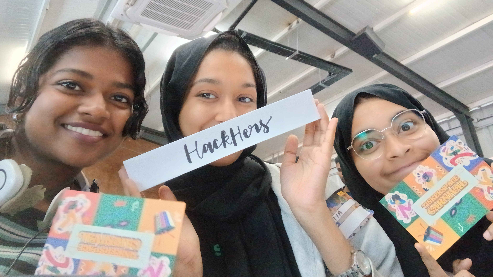

# Project Documentation

For Software:

## Screenshots (Add at least 3)

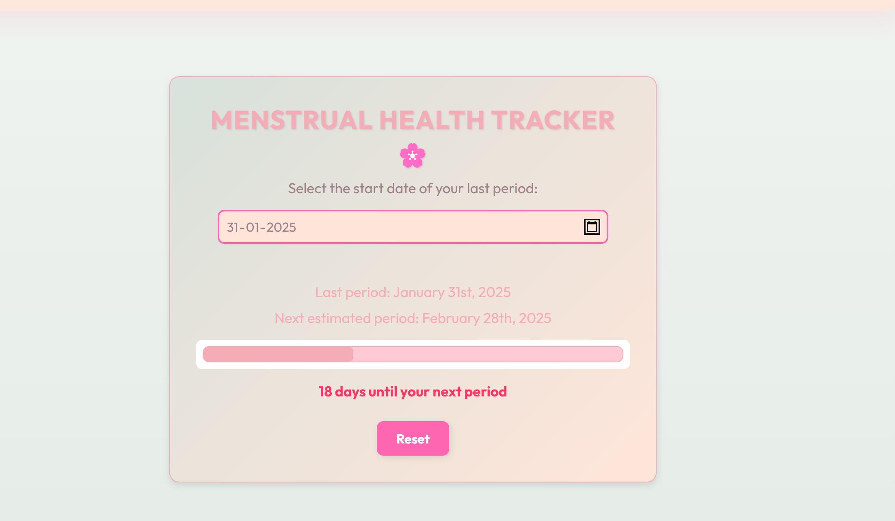
_This screenshot displays the user interface for tracking menstrual cycles, allowing users to log their periods and symptoms._

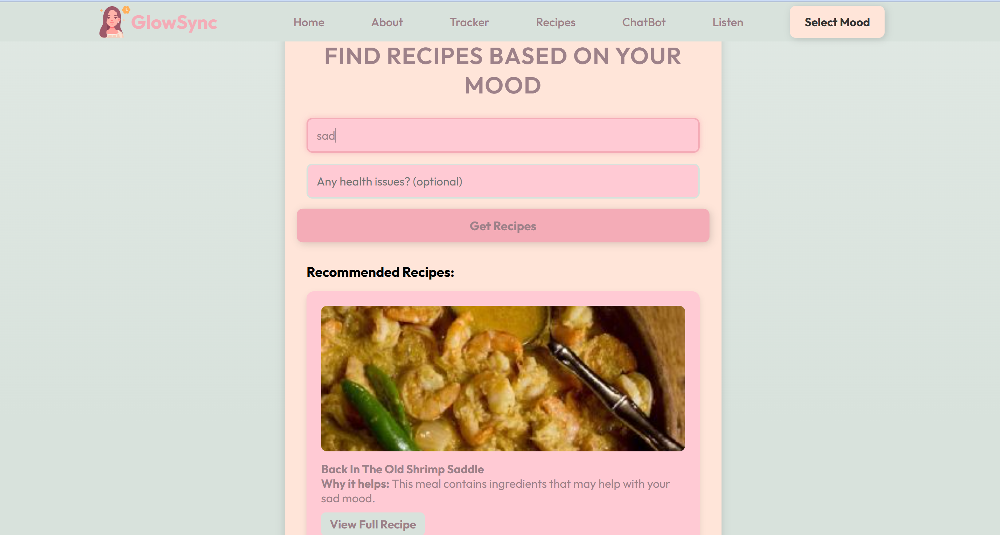
_This image showcases personalized recipe recommendations based on the user's current mood input._

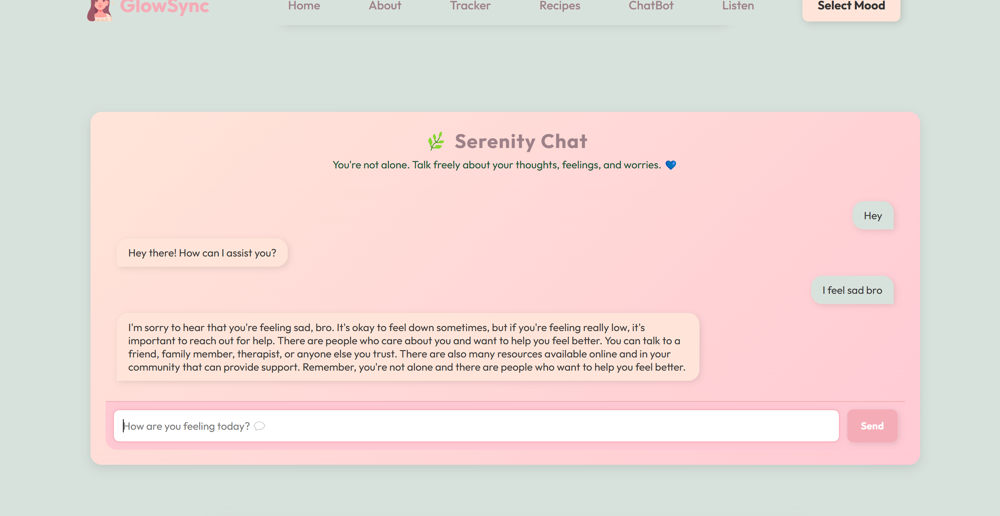
_This screenshot illustrates the AI chatbot assisting users with personalized support and information._

## Components

### Header

  


### Hero


### Waves


### About

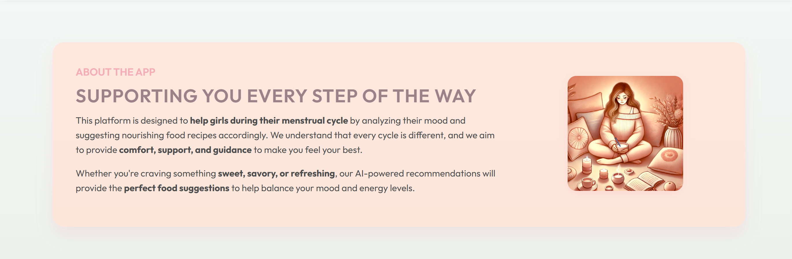

### Tracker

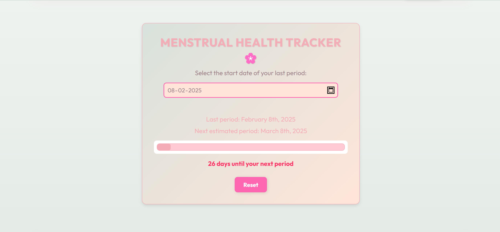

### Mood Tracker

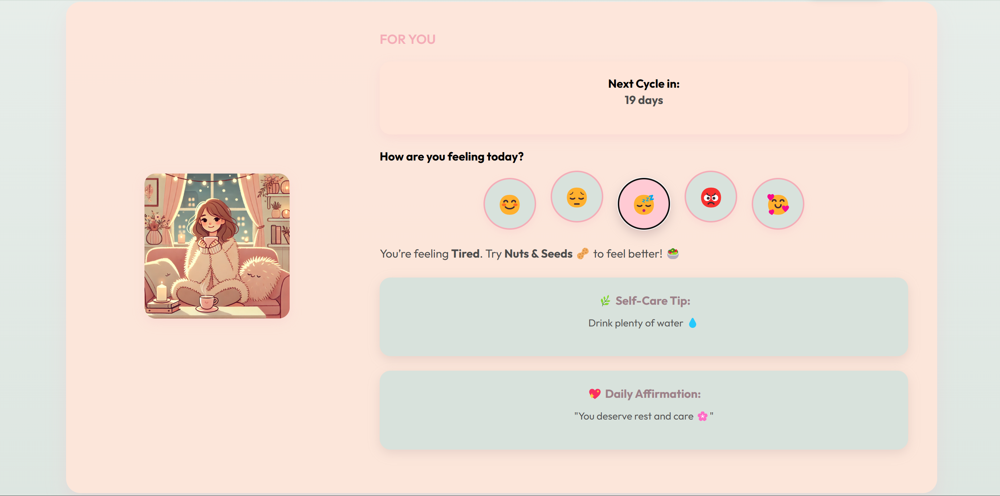

### Recipe

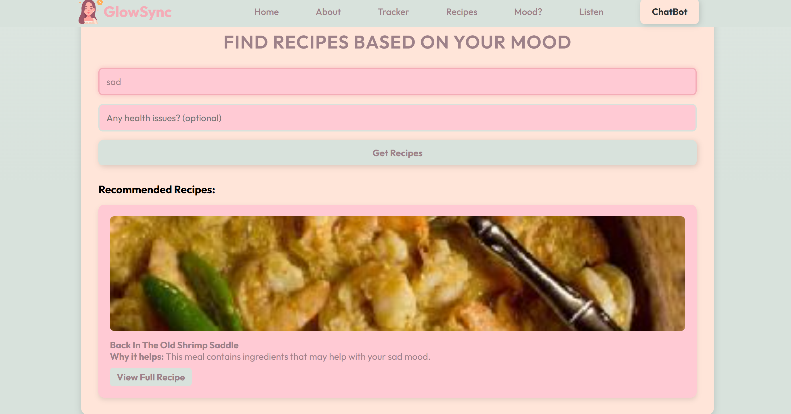

### Listen

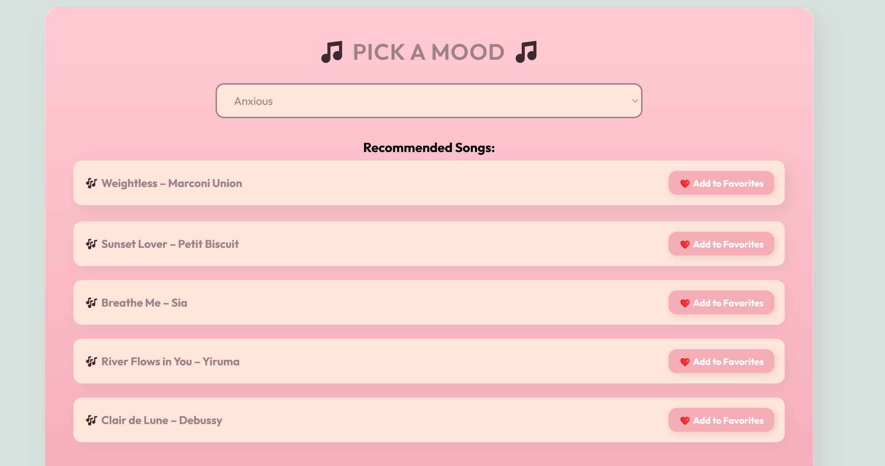  
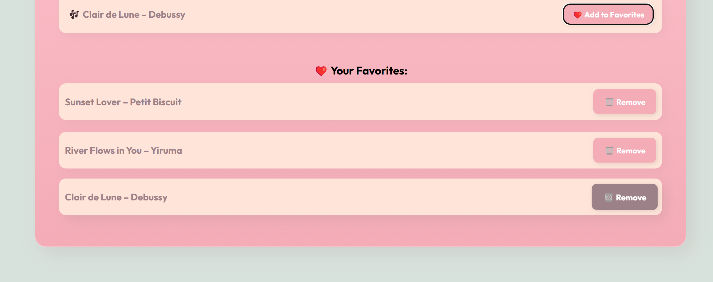

### ChatBot

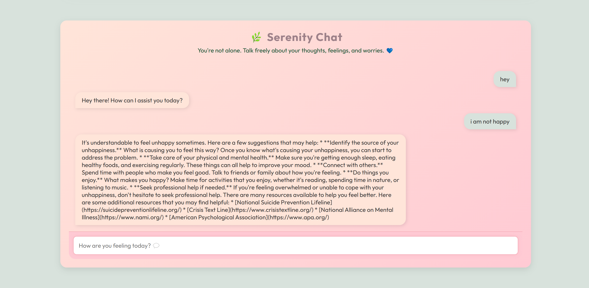

### Footer


Explain the build steps


Explain the final build

### Project Demo

# Video

  
This video demonstrates the key features and functionalities of the project, including [brief description of what the video showcases].

## Team Contributions

- [Fathimath Dhaliya Noushad VP]: [Menstrual Tracker,Chatbot]
- [Fathima Rasha Rahim]: [Food Recommendation,Header]
- [Ranjana KP]: [Hero,About,Songs Recommendation]

Made with ❤️ at TinkerHub
